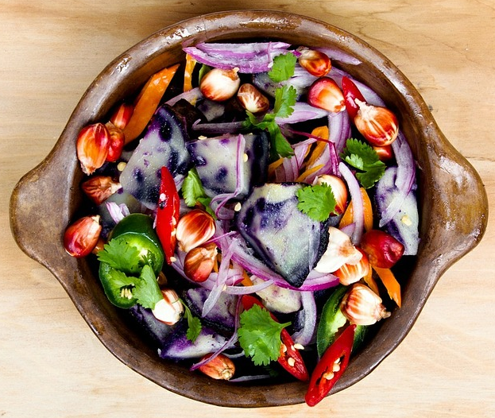
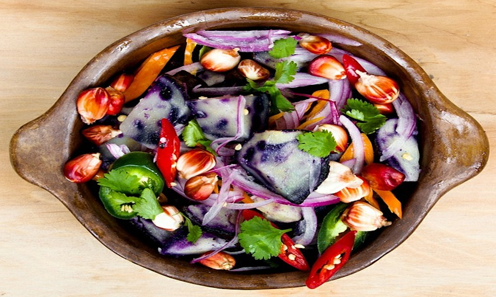
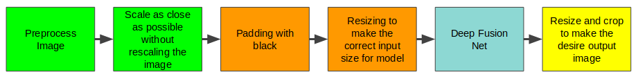

# Smart Scaler-Paint the gap with AI

This work is done in collaboration with [Kurbric](http://kubric.io).

Images are created in various sizes and aspect ratios. However, there are cases
that we need to fit an image in a placer holder that have different size and/or aspect ratio.
Resizing without changing the aspect ratio will not distort the objects in the image, but if 
one changes the aspect ratio, the main objects may become distorted. For example, suppose we
have the following image.

and we would like to fit this image into the following placeholder.

 
If we use a simple stretching approach, we would get the following image

As can be seen from the above image the bowl of salad has be distorted, which is not acceptable
for some businesses. So, a more sophisticated method is needed. [Seam Carving](https://en.wikipedia.org/wiki/Seam_carving)
is a method that can be use for rescaling images. However, for the pictures that have very small area around the main objects, Seam Carving does not work very well. The result of using Seam Carving on the salad dish can be seen in the following image

AAs the image shows the main objects have been deformed. Therefore, to solve the following problem, I considered using deep neural networks, in particular pretrained model designed for performing inpainting.

[Inpainting](https://en.wikipedia.org/wiki/Inpainting) is a technique to reconstruct the missing or damage part of an image. Different inpainting models using deep neural networks have been devised. After checking several inpainting models, [Deep Fusion Network](https://github.com/hughplay/DFNet) (DFNet) demonstrated the best results for my problem. In the first approach, I used a pretrained DFNet in the following pipeline 

